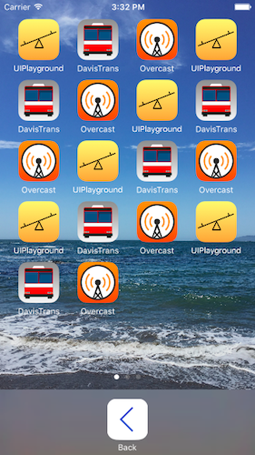

UIPlayground
============

A collection of user interfaces seen in iOS written in Swift.

See [Todo](UIPlayground/Todo.md) for a list of improvements.

Power Off
---------

Mimics parts of the iOS power off view.

App Cards
---------

Mimics parts of the iOS app switcher view.

Spring Board
------------

Mimics parts of the iOS app spring board view.

