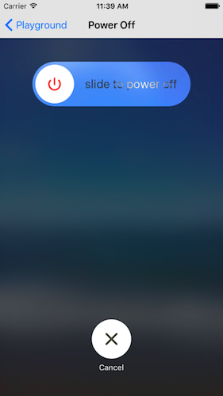
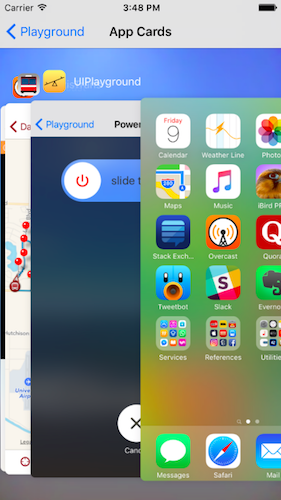

UIPlayground
=========

A collection of user interfaces seen in iOS.

Power Off
---------

Mimics the iOS power off view.

Improvements/Bugs:

- The timing curves for various animations could be tuned to more closely match the iOS animations:
- The "slide to power off" shimmer look doesn't quite match the one on iOS.
- The "slide to power off" shimmer should begin at the beginning immediately after the slider animates back to the start position.
- The power off thumb button should animate to black after/while slider moves to the end position.

App Cards
---------

Mimics the iOS app switcher view.

Implementation of this is still very much in progress.

